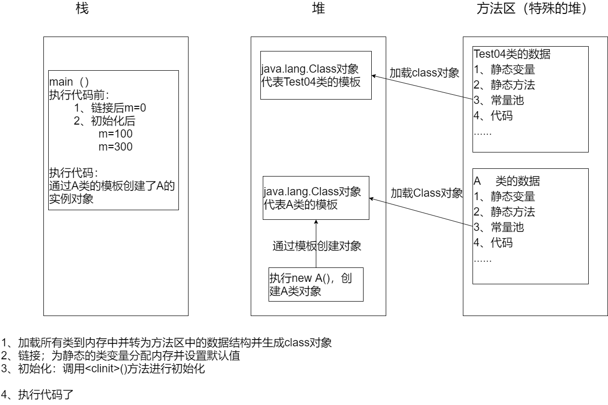

# 类加载（双亲委派机制）

将class文件字节码内容加载到内存中，并将这些静态数据转换成方法区的运行时数据结构，然后生成一个代表这个类的java.lang.Class对象。

# 类链接

将Java类的二进制代码合并到JVM的运行状态之中的过程。

### 验证

确保加载的类信息符合JVM规范，没有安全方面的问题

### 准备

	正式为类变量（static）分配内存并设置类变量默认初始化的阶段，这些内存都将在方法区中进行分配。
	
	为final修饰的static变量直接赋值。

### 解析

虚拟机常量池类的符号引用（常量名）替换为直接引用（地址）的过程。

# 初始化

1. 执行类构造器<clinit>()方法的过程。类构造器<clinit>()方法是由编译期自动收集类中的所有类变量的赋值动作和静态代码块中的语句合并产生的。（类构造器是构造类信息的，不是构造该类对象的构造器）。
2. 当初始化一个类的时候，如果发现其父类还没有进行初始化，则需要先出发其父类的初始化。
3. 虚拟机会保证一个类的<clinit>()方法在多线程环境中被正确的加锁同步。

# 参考图片

# 会执行初始化的情况

类的主动引用

1. 西立即启动后，先初始化main方法所在类
2. new一个类对象
3. 调用类的static（除 final）变量和静态方法
4. 使用java.lang.reflect包方法对类进行反射调用
5. 当初始化一个类，父类未被初始化
   

# 不会执行初始化的情况

类的被动引用

1. 通过子类调用父类的静态变量/方法（例如：xxx = 子类名. 父类名.父类静态变量）
2. 通过数组定义类引用（Objectname obj[] = new Objectname[5]，该操作只会开辟类大小的内存供后续操作）
3. 引用常量（常量在链接阶段就存入调用类的常量池中）
